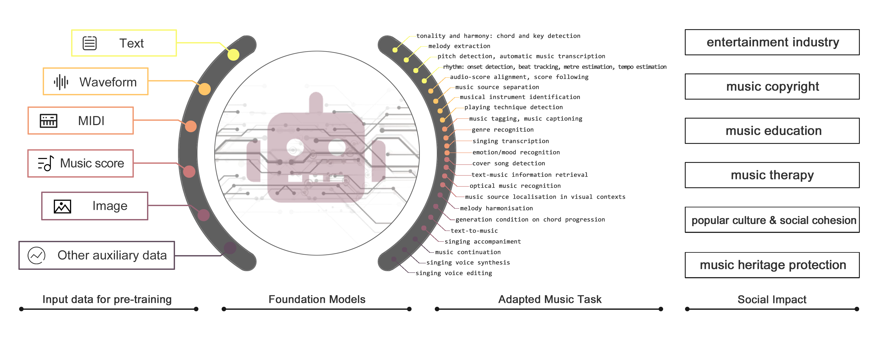

# FM4Music
The official GitHub page for the survey paper "Foundation Models for Music: A Survey".




> A collection of papers and resources related to Foundation Models (FMs) for Music, including pre-trained language models (PLMs), Large Language Models (LLMs) and Latent Diffusion Models (LDMs) 
>
> The organisation of papers refers to our survey [**"Foundation Models for Music: A Survey"**](). 
>
> Please let us know if you find out a mistake or have any suggestions by e-mail: yinghao.ma@qmul.ac.uk
>
> If you find our survey useful for your research, please cite the following paper:

```
@article{FM4MusicSurvey,
  title={Foundation Models for Music: A Survey},
  author={Ma, Yinghao and {\O}land, Anders and Ragni, Anton and Del Sette, Bleiz MacSen and Saitis, Charalampos and Donahue, Chris and Lin, Chenghua and Plachouras, Christos and Benetos, Emmanouil and Shatri, Elona and others},
  journal={arXiv preprint arXiv:2408.14340},
  year={2024}
}
```

<!-- ## Table of Contents

- [LLMSurvey](#llmsurvey)
  - [Chinese Version](#chinese-version)
  - [🚀(New) The trends of the number of papers related to LLMs on arXiv](#new-the-trends-of-the-number-of-papers-related-to-llms-on-arxiv)
  - [🚀(New) Technical Evolution of GPT-series Models](#new-technical-evolution-of-gpt-series-models)
  - [🚀(New) Evolutionary Graph of LLaMA Family](#new-evolutionary-graph-of-llama-family)
  - [🚀(New) Prompts](#new-prompts)
  - [🚀(New) Experiments](#new-experiments)
    - [Instruction Tuning Experiments](#instruction-tuning-experiments)
    - [Ability Evaluaition Experiments](#ability-evaluaition-experiments)
  - [Table of Contents](#table-of-contents)
  - [Timeline of LLMs](#timeline-of-llms)
  - [List of LLMs](#list-of-llms)
  - [Paper List](#paper-list)
    - [Resources of LLMs](#resources-of-llms)
      - [Publicly Available Models](#publicly-available-models)
      - [Closed-source Models](#closed-source-models)
      - [Commonly Used Corpora](#commonly-used-corpora)
      - [Library Resource](#library-resource)
      - [Deep Learning Frameworks](#deep-learning-frameworks)
    - [Pre-training](#pre-training)
      - [Data Collection](#data-collection)
      - [Architecture](#architecture)
        - [Mainstream Architectures](#mainstream-architectures)
        - [Detailed Configuration](#detailed-configuration)
        - [Analysis](#analysis)
      - [Training Algorithms](#training-algorithms)
      - [Pre-training on Code](#pre-training-on-code)
        - [LLMs for Program Synthesis](#llms-for-program-synthesis)
        - [NLP Tasks Formatted as Code](#nlp-tasks-formatted-as-code)
    - [Adaptation Tuning](#adaptation-tuning)
      - [Instruction Tuning](#instruction-tuning)
      - [Alignment Tuning](#alignment-tuning)
      - [Parameter-Efficient Model Adaptation](#parameter-efficient-model-adaptation)
      - [Memory-Efficient Model Adaptation](#memory-efficient-model-adaptation)
    - [Utilization](#utilization)
      - [In-Context Learning (ICL)](#in-context-learning-icl)
      - [Chain-of-Thought Reasoning (CoT)](#chain-of-thought-reasoning-cot)
      - [Planning for Complex Task Solving](#planning-for-complex-task-solving)
    - [Capacity Evaluation](#capacity-evaluation)
    - [The Team](#the-team)
  - [Acknowledgments](#acknowledgments)
  - [Update Log](#update-log) -->

## Examples of Industrial Applications
### Application in Music Industry
- [SunoAI](https://suno.com/)
- [TiangongAI](https://music.tiangong.cn/)
- [Udio](https://www.udio.com/)
### General Model with a Little Music Capability
- GPT-4o
- Gemini Pro
- [Qwen-audio](https://huggingface.co/Qwen/Qwen-Audio)


## List of Foundation Models for Music
<!-- image of training paradigm -->
### Contrastive Learning for Music Understanding 
| Model       | Modality             | Application | Training Paradigm          | Music Tokeniser | Architecture                      |
|-------------|----------------------|-------------|----------------------------|-----------------|-----------------------------------|
| COLA        | Audio (Speech, Sound & Music) | Understanding | Contrastive Learning | spectrum        | CNN Encoder                       |
| MULE        | Audio (Music)        | Understanding | Contrastive Learning | spectrum        | CNN Encoder                       |
| CLAP        | Audio (Sound), Text  | Understanding | Contrastive Learning | spectrum        | Transformer Encoder               |
| MusCALL     | Audio (Music), Text  | Understanding | Contrastive Learning | spectrum        | CNN Encoder                       |
| MuLan       | Audio (Music), Text  | Understanding | Contrastive Learning | Spectrum        | CNN Encoder & Transformer Encoder |
| CLAMP       | Symbolic (MIDI), Text | Understanding | Contrastive Learning | MIDI            | Transformer Encoder               |
| Wav2CLIP    | Audio (Sound), Text, Image | Understanding | Contrastive Learning | spectrum        | CNN Encoder                       |
| AudioCLIP   | Audio (Sound), Text, Image | Understanding | Contrastive Learning | spectrum        | CNN Encoder                       |
| vq-wav2vec  | Audio (Speech)       | Understanding | MLM (Clustering via CL.) | 1-D CNN         | CNN Encoder                       |
| wav2vec 2.0 | Audio (Speech)       | Understanding | MLM (Clustering via CL.) | 1-D CNN         | Transformer Encoder               |
| HuBERT      | Audio (Speech)       | Understanding | MLM (Clustering via CL.) | 1-D CNN         | Transformer Encoder               |
| BEST-RQ     | Audio (Speech)       | Understanding | MLM (Clustering via CL.) | Spectrum        | Transformer Encoder               |
| musicHuBERT | Audio (Music)        | Understanding | MLM (Clustering via CL.) | 1-D CNN         | Transformer Encoder               |
| MERT        | Audio (Music)        | Understanding | MLM (Clustering via CL.) | 1-D CNN         | Transformer Encoder               |
| MusicFM     | Audio (Music)        | Understanding | MLM (Clustering via CL.) | Spectrum, BEST-RQ | Conformer Encoder              |

### Generative Model (VAE, GPT, Diffusion)
| Model                | Modality                | Application | Training Paradigm | Tokenizer                           | Architecture               |
|----------------------|-------------------------|-------------|-------------------|-------------------------------------|----------------------------|
| Jukebox, JukeMIR     | Audio (Music)           | Both        | VAE, GPT          | 1-D CNN                             | Transformer Encoder Decoder|
| MusER                | Symbolic (MIDI)         | Generation  | VAE               |                                     |                            |
| Singsong             | Audio (Music)           | Generation  | GPT               | Discrete Tokens (Soundstream & w2v-BERT) |                            |
| AudioLM              | Audio (Sound), Text     | Generation  | GPT               | Discrete Tokens (Soundstream & w2v-BERT) | Transformer Decoder       |
| MusicGen             | Audio (Music), Text     | Generation  | GPT               | Discrete Acoustic Tokens (EnCodec)  | Transformer Decoder       |
| MusicLM              | Audio (Music), Text     | Generation  | GPT               | Discrete Tokens (Soundstream & w2v-BERT) |                            |
| Music Transformer    | Symbolic (MIDI)         | Generation  | GPT               |                                     |                            |
| pop music Transformer| Symbolic (MIDI)         | Generation  | GPT               |                                     |                            |
| Jazz Transformer     | Symbolic (MIDI)         | Generation  | GPT               |                                     |                            |
| MelodyGLM            | Symbolic (MIDI)         | Generation  | GPT               |                                     |                            |
| MUPT                 | Symbolic (ABC)          | Generation  | GPT               | ABC (SMT-ABC)                       | Transformer Decoder       |
| SpeechGPT            | Audio (Sound), Text     | Both        | GPT               | Discrete Acoustic Token             | Transformer Decoder       |
| LauraGPT             | Audio (Sound), Text     | Both        | GPT               | Spectrum/ Discrete Acoustic Token   | Transformer Decoder       |
| Audio-PaLM           | Audio (Sound), Text     | Both        | GPT               | 1-D CNN                             | Transformer Decoder       |
| MuseCoCo             | Symbolic (MIDI), Text   | Generation  | GPT               |                                     |                            |
| ChatMusician         | Symbolic (ABC), Text    | Both        | GPT               | ABC (BPE)                           | Transformer Decoder       |
| AudioLDM             | Audio (Sound), Text     | Generation  | Diffusion         | Spectrum                            | Transformer Encoder Decoder|
| AudioLDM2            | Audio (Sound), Text     | Generation  | Diffusion         | Spectrum                            | Transformer Encoder Decoder|
| Make-An-Audio 1      | Audio (Sound), Text     | Generation  | Diffusion         |                                     |                            |
| Make-An-Audio 2      | Audio (Sound), Text     | Generation  | Diffusion         |                                     |                            |
| Stable Audio Open    | Audio (Sound), Text     | Generation  | Diffusion         |                                     |                            |
|      CRASH     | Audio (Music), Text     | Generation  | Diffusion         | Spectrum, CNN                       | Transformer Encoder Decoder|
| Noise2Music          | Audio (Music), Text     | Generation  | Diffusion         | Spectrum, CNN                       | Transformer Encoder Decoder|
| Mousai               | Audio, Text             | Generation  | Diffusion         |                                     |                            |
| MusicLDM             | Audio (Music), Text     | Generation  | Diffusion         | Spectrum                            |                            |
| TANGO                | Audio (Music), Text     | Generation  | Diffusion         | Spectrum                            |                            |
| JEN-1                | Audio (Music), Text     | Generation  | Diffusion         |                                     |                            |
| Diff-A-Riff     | Audio (Music), Score     | Generation  | Diffusion         |                                     |                            |
| GETMusic             | Symbolic (MIDI)         | Generation  | Diffusion         | MIDI (GETscore)                     | Transformer Encoder Decoder|
| whole-song-gen       | Symbolic (MIDI)         | Generation  | Diffusion         |                                     |                            |

### Mask Modelling and Online Distillation
| Model            | Modality                    | Application   | Training Paradigm           | Tokenizer                     | Architecture                 |
|------------------|-----------------------------|---------------|-----------------------------|--------------------------------|------------------------------|
| MAE-AST          | Audio (Speech & Sound)      | Understanding | MLM                         | Spectrum                       | Transformer Encoder Decoder  |
| Audio-MAE        | Audio (Speech & Sound)      | Understanding | MLM                         | Spectrum                       | Transformer Encoder          |
| SSAST            | Audio (Speech & Sound)      | Understanding | MLM                         | Spectrum                       | Transformer Encoder          |
| Beats            | Audio (Sound)               | Understanding | MLM                         | Spectrum                       | Transformer Encoder          |
| DiscreteBERT     | Audio (Speech)              | Understanding | MLM                         | vqwav2vec                      | Transformer Encoder          |
| WavLM            | Audio (Speech)              | Understanding | MLM                         | 1-D CNN                        | Transformer Encoder          |
| w2v-BERT         | Audio (Speech, Audio, Music)| Understanding | MLM, Contrastive Learning   | Spectrum                       | Transformer Encoder          |
| ampNet           | Audio (Music)               | Generation    | MLM                         | Discrete Tokens (DAC)          | Transformer Encoder Decoder  |
| MidiBERT-Piano   | Symbolic (REMI)             | Understanding | MLM                         | REMI, compound word            | Transformer Encoder          |
| MusicBERT        | Symbolic (MIDI)             | Generation    | MLM                         | MIDI (OctupleMIDI)             | Transformer Encoder Decoder  |
| MRBERT           | Symbolic (MusicXML)         | Generation    | MLM                         | MusicXML Note Event, Compound Word | Transformer Encoder Decoder |
| EAT              | Audio (Sound)               | Understanding | MLM (Online Distillation)   | Spectrum                       | Transformer Encoder          |
| A-JEPA           | Audio (Speech & Sound)      | Understanding | MLM (Online Distillation)   | Spectrum                       | Transformer Encoder          |
| data2vec         | Audio (Speech)              | Understanding | MLM (Online Distillation)   | 1-D CNN                        | Transformer Encoder          |
| MT4SSL           | Audio (Speech)              | Understanding | MLM, MLM (Online Distillation) | 1-D CNN                      | Transformer Encoder          |
| data2vec 2.0     | Audio (Speech)              | Understanding | MLM (Online Distillation)   | 1-D CNN                        | Transformer Encoder          |
| M2-Duo           | Audio (Speech, Audio, Music)| Understanding | MLM (Online Distillation)   | Spectrum                       | Transformer Encoder          |
| music2vec        | Audio (Music)               | Understanding | MLM (Online Distillation)   | 1-D CNN                        | Transformer Encoder          |
| MuLaP            | Audio (Music), Text         | Understanding | MLM                         | 1-D CNN                        | Transformer Encoder          |
| JMLA             | Audio (Sound), Text         | Understanding | MLM (Online Distillation)   | Spectrum                       | Transformer Encoder Decoder  |
| MusIAC           | Symbolic (REMI), Text       | Generation    | MLM                         | REMI                           | Transformer Encoder Decoder  |
| AV-HuBERT        | Audio (Speech), Image       | Understanding | MLM                         | 1-D CNN                        | Transformer Encoder          |

### Prefix tuning and Adaptor tuning
| Model       | Modality                             | Application   | Training Paradigm          | Tokenizer                      | Architecture                 |
|-------------|--------------------------------------|---------------|-----------------------------|--------------------------------|------------------------------|
| Qwen-Audio  | Audio (Speech, Sound & Music), Text  | Understanding | prefix tuning, GPT         | 1-D CNN                        | Transformer Encoder Decoder  |
| LLaRK       | Audio (Music), Text                  | Understanding | prefix tuning, GPT         | Pre-trained model (CLAP, Jukebox) | Transformer Decoder       |
| Musilingo   | Audio (Music), Text                  | Understanding | prefix tuning, GPT         | Pre-trained model (MERT)       | Transformer Decoder          |
| MU-LLaMA    | Audio (Music), Text                  | Understanding | adapter tuning, GPT        | Pre-trained model (MERT)       | Transformer Decoder          |
| M2UGen      | Audio (Music), Image, Text           | Both          | adapter tuning, GPT        | Pre-trained model (MERT)       | Transformer Decoder          |
| SALMONN     | Audio (Sound & Speech), Text         | Understanding | adapter tuning, GPT        | Pre-trained model (Whisper, BERT) | Transformer Decoder       |
| LTU         | Audio (Sound), Text                  | Understanding | adapter tuning, GPT        | Pre-trained model (Whisper)    |                              |


## Dataset
### Symbolic Music and Acoustic Music
| Dataset                         | Modality                        | n files                        | Description                                                  |
|---------------------------------|---------------------------------|--------------------------------|--------------------------------------------------------------|
| Wikifonia                       | MusicXML                        | 2,252 CSV samples              | CSV of MusicXML from Wikifonia.org.                          |
| MuseScore Lead Sheet Dataset    | MusicXML, MIDI                  | 226 pieces with 336k notes     | Derived from MuseScore website                               |
| Hooktheory Lead Sheet Dataset   | MusicXML                        | 11,329 lead sheet samples      | Derived from TheoryTab music theory forum [link](https://www.hooktheory.com/theorytab) |
| IrishMAN                        | ABC, MIDI, MusicXML             | 216,284                        | Scottish & Irish folk songs.                                 |
| Nottingham Music Dataset        | ABC notations                   | 1,200                          | Online corpus of British & American folk songs.              |
| ABC tune book of Henrik Notebook| ABC notations                   | 2,800                          | Irish & Swedish folk songs                                   |
| Lakh MIDI Dataset               | MIDI                            | 176,581 files                  | Mainly Pop, Rock                                             |
| Yamaha Signature MIDI Collection| MusicXML, MIDI                  | 1.4k                           | Piano performance, mainly Romantic pieces                    |
| DoReMi                          | Image, MusicXML, MEI, MIDI      | 6k                             | Steinberg's Dorico                                           |
| ADL piano dataset               | MIDI                            | 11,086                         | Pop, classical and jazz piano pieces                         |
| Symphonies                      | MIDI                            | 46,359 files, 650 hours        | Classical symphony with multi-instruments                    |
| NES-MDB                         | MIDI                            | 5,278                          | NES games BGM.                                               |
| MAESTRO                         | MIDI, audio                     | 1.2k files                     | Classical Piano                                              |
| GiantMIDI-Piano                 | MIDI, audio                     | 10,855 pieces, 1237 hours      | Machine transcribed.                                         |
| Meta-MIDI                       | MIDI, audio                     | 436,631 MIDI files             |                                                              |
| Free Music Archive (FMA)        | audio                           | 106,574 tracks, 8.2k hours     | Collected from FMA website                                   |
| MTG-Jamendo                     | audio                           | 55,701 tracks, 3.8k hours      | Collected from Jamendo website                               |
| Music4ALL                       | audio                           | 109,269 tracks, 911 hours      | Collected from YouTube                                       |
| Million Song Dataset (MSD)      | audio feature                   | 1,000,000                      |                                                              |
| AudioSet                        | URL of audio                    | 1,011,305 music clips          | 2,084,320 clips including general audio                      |
| AcousticBrainz                  | audio feature                   | 2,524,739                      |                                                              |
| Disco-10M                       | feature & URL of audio          | 15,296,232                     |                                                              |

### Multimodal Music Dataset
| Dataset                    | Modality              | n files                           | Tasks                                   |
|----------------------------|-----------------------|-----------------------------------|-----------------------------------------|
| LP-MusicCaps-MSD           | audio URL, text       | 520k audio, 1.5M text             | music captioning                        |
| Song Describer Dataset (SDD)| audio, text           | 706 audio, 1.1k                   | music captioning, text-to-music, retrieval|
| MusicQA                    | audio, text           | 12,542 clips, 112,878 Q&A         | acoustic music instruction following    |
| MusicInstruct              | audio URL, text       | 5.5k clips, 60,493 Q&A            | acoustic music instruction following    |
| MusicBench                 | audio, text           | 52,768 text-audio pairs           | text to music                           |
| MARD                       | audio URL, text       | 65,566 albums, 263,525 reviews    |                                         |
| MUEdit                     | audio pairs, text     | 10,815 text, 60.22 hours          | music editing with text prompt          |
| WikiMusicText (WikiMT)     | ABC, text             | 1,010                             | Text to music, Music captioning         |
| IMAC                       | audio URL, image URL  | 85k images, 3,812 songs           | Affective Music-Image correspondences   |
| URMP                       | MIDI, Audio, Video    | 44 pieces                         | audiovisual symphony separation         |
| URSing                     | audio, video          | 65 pieces, 4 hours                | audiovisual singing voice separation    |
| RAVDESS                    | audio, video          | 7,356 pieces                      | Speech & songs in different emotion and intensity|
| EmoMV                      | audio, video          | 5,986 pairs                       | Affective Music-Video Correspondences   |
| SymMV                      | MIDI, audio, video    | 1,140 pairs, 76.5 hours           | video background music generation       |
| MUImage                    | audio, image          | 9,966 text, 27.72 hours           | image to music                          |
| MUVideo                    | audio, video          | 13,203 text, 36.72 hours          | video to music                          |
| AnyInstruct                | text, audio, images   | 108k instruction-following entries| instruction following w/ interleaved format |
| V2M                        | audio, video          | 190k pairs, 6403 hours            | video to music                          |
| MMtrail                    | text, audio, video    | 20m pairs, 27.1k hours            | text to music, video to music           |


### Library Resource
- Symbolic Music: mido, pretty_midi, note_seq
- Audio Processing: librosa, Essentia, madmom
- audio I/O: torchaudio with sox_io backend is advised due to its superior speed and performance compared to alternatives like soundfile backend.

## Evaluation
### Benchmark of Music Understanding
- MuChoMusic Benchmark
- MusicTheoryBenchmark in ChatMusician
- Music subset of Massive Multi-discipline Multimodal
Understanding and Reasoning Benchmark (MMMU) 
- ZIQI-Eval Benchmark

## Acknowledge
Yinghao Ma is a research student at the
UKRI Centre for Doctoral Training in Artificial Intelligence and Music, supported by
UK Research and Innovation [grant number
EP/S022694/1]. 
Emmanouil Benetos is supported
by a RAEng/Leverhulme Trust Research Fellowship [grant number LTRF2223-19-106].

We thank Dr. Zhiyao Duan’s suggestions on the introduction, presentation sections and multimodal dataset subsection.
We thank Dr Jie Fu’s suggestions on the multimodal music
understanding subsection. We thank Pedro Sarmento for his
help documenting initiatives towards AI transparency in the
music industry. We also thank Andrew Zigerelli, Qixiao Zhu,
and Rikki Hung for their help on evaluation methods of music
generation.

Last but not least, we acknowledge Junhong Li’s kind help
with illustrations.

## Version Control
- Tue, 27th Aug. 2024: fix some typos
- Tue, 3rd Sept. 2024: include more music diffusion model, update conclusion and discussion, update author list
